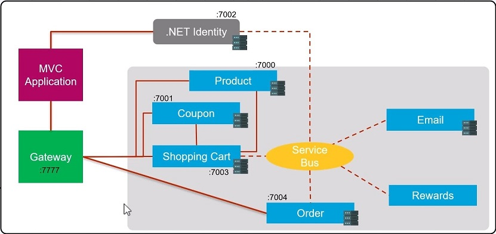

**.NET Core MicroServices**

Pre Requisite

**Technology** - 
ASP.NET Core

**Language** - 
C#

**Markup Language & Styling** - 
Html5, Css, Bootstrap

**Database** - 
SQL Server

**Tools** - 
Visual Studio 2022, Postman(Optional)

**Version Control** - 
Github

**Other 3rd party services required** - 
Azure Service, Stripe

Note:- Basic understanding on c# and .NET Core framework is required.

**ECommerse WebSite - Online Food Shopping**

**Purpose of this Project**

In this Project our main intention is to break down monolithic application to small micro services, So that project should be easily maintainable and testable and scalable. For that we have used some web api's which will be our
micro services and web app for UI, in which we will show how web app and web api's are communicating with each other.

**MicroServices Application Flow Diagram**

_Till now implemented_ total 5 micro services and a web app on which i have used ASP.NET MVC pattern.
For Front End i have used basic Html, css, bootstrap and some asp.net html attributes to create the view pages.
and For Back End i am using .NET Core Framework.
Every Microservices is assigned with some specific port which will be used during accessing resources for the services through url with the port no.
Dashed Line shows synchronous communication whereas dotted line shows asynchronous communication.

Added **Authentication and Authroization** using Jwt token for token exchange to access resources based on role.
Added **cookies** to save the token for certain period of time for a user to validate user is still signed in.
Authentication and Authroization to accept token in swagger based on role to access on particular resource.

Added **Azure Message Service** for asynchornous Communication between services.
Added **Stripe** Session for Payments.

